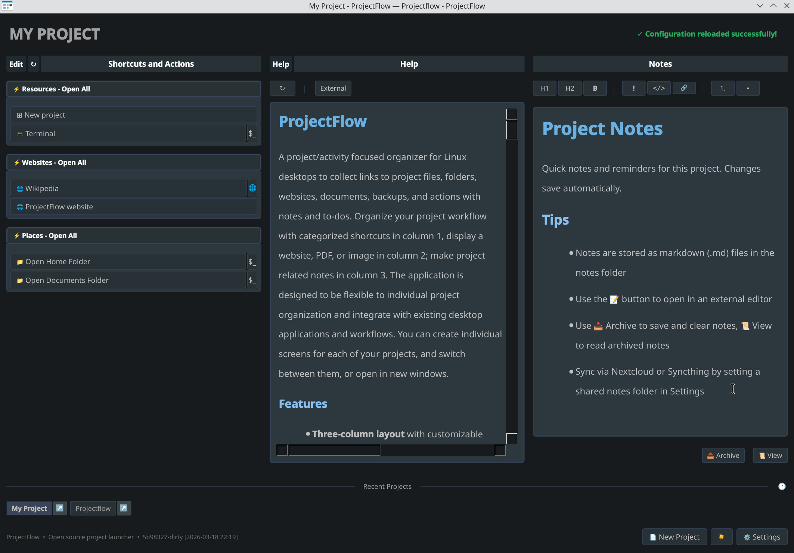
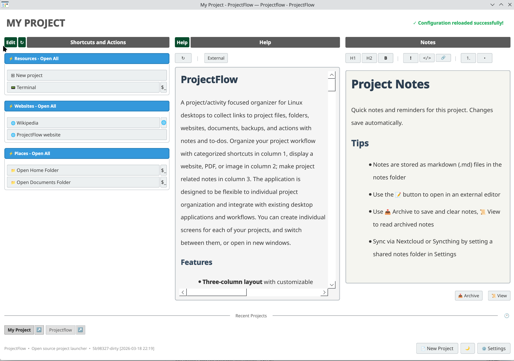

# ProjectFlow

A project/activity focused organizer for Linux desktops to collect links to project files, folders, websites, documents, backups, and actions with notes and to-dos. Organize your project workflow with categorized shortcuts in column 1, display a website, PDF, or image in column 2; make project related notes in column 3. The application is designed to be flexible to individual project organization and integrate with existing desktop applications and workflows. You can create individual screens for each of your projects, and switch between them, or open in new windows.





## Features

- **Three-column layout** with customizable categories
- **Central viewer** toggles between PDF, web browser, image viewer, help, and console
- **Quick project switching** via recent projects bar with drag-to-reorder
- **Edit mode** for adding/modifying entries without editing JSON
- **Per-project notes** with markdown support and archive feature
- **Custom launch handlers** for complex workflows
- **Theme support** with light, dark, and system-following modes
- **Desktop menu integration** for KDE, GNOME, and other freedesktop-compliant desktops

## Installation

### Standard Linux (Ubuntu, Fedora, Debian, etc.)

Install dependencies via pip:

```bash
pip install PyQt6 PyQt6-WebEngine PyMuPDF qtconsole
```

Or via your package manager (package names may vary):

```bash
# Debian/Ubuntu
sudo apt install python3-pyqt6 python3-pyqt6.qtwebengine python3-fitz
```

Then run:

```bash
./projectflow.py
```

### NixOS

Use the provided wrapper script which handles dependencies automatically:

```bash
./projectflow-nix
```

## Usage

```bash
# Standard Linux
./projectflow.py                              # Use default project
./projectflow.py projects/myproject.json      # Use specific project

# NixOS
./projectflow-nix                             # Use default project
./projectflow-nix projects/myproject.json     # Use specific project
```

### Adding to Desktop Menu

You can add any project to your desktop application menu:

1. Open the project in ProjectFlow
2. Click **Edit** → **Advanced** → **Project Defaults** tab
3. Click **Create Menu Entry**

This creates a `.desktop` file with a right-click menu for quick switching between projects.

## Projects

Projects are JSON files stored in the `projects/` directory. Each project defines categories and items.

### Basic Structure

```json
{
  "column_headers": ["Projects", "Resources", "Notes"],
  "columns": [
    [
      {
        "Category Name": [
          ["Display Name", "/path/to/item", "application"],
          ["Website", "https://example.com", "firefox"]
        ]
      }
    ],
    [],
    []
  ]
}
```

### Project Options

| Option | Description |
|--------|-------------|
| `pdf_file` | Default PDF to load |
| `webview_url` | Default URL for web viewer |
| `image_file` | Default image to display |
| `console_path` | Default directory for embedded console |
| `column2_default` | Initial viewer mode: `"pdf"`, `"webview"`, `"image"`, `"help"`, or `"console"` |

## Launch Handlers

### Works Out of the Box

These handlers use system defaults and work on any Linux desktop:

| Handler | Description |
|---------|-------------|
| `browser` | Open URL in default browser (xdg-open) |
| `file_manager` | Open folder in default file manager (xdg-open) |
| `editor` | Open file in default editor (xdg-open) |
| `default` | Let system decide how to open (xdg-open) |
| `terminal` | Open folder in terminal (auto-detects: KDE=konsole, GNOME=gnome-terminal, etc.) |

### Browser Handlers

```json
["My Site", "https://example.com", "firefox"]
["My Site", "https://example.com", "chrome"]
```

### npm Handler

Run npm commands in terminal:

```json
["My App", "~/projects/myapp", "npm"]           // npm start
["My App", "~/projects/myapp dev", "npm"]       // npm run dev
["My App", "~/projects/myapp build", "npm"]     // npm run build
["My App", "~/projects/myapp test", "npm"]      // npm test
["My App", "~/projects/myapp install", "npm"]   // npm install
```

### SSH Session Handler

SSH with cd/command support:

```json
["Server", "user@host", "ssh_session"]                      // SSH, run bash
["Server", "user@host cd /var/www", "ssh_session"]          // SSH, cd to dir
["Server", "user@host cd /app npm start", "ssh_session"]    // SSH, cd, run command
```

### Dev Environment Handler

Open full dev environment (file manager + terminal + VSCode, optionally npm):

```json
["My Project", "~/projects/myapp", "directorydev"]           // Opens 3 apps (no npm)
["My Project", "~/projects/myapp dev", "directorydev"]       // Also runs npm run dev
["My Project", "~/projects/myapp build", "directorydev"]     // Also runs npm run build
```

Main button opens all apps. The npm button only appears if a command is specified.

### Backup Handlers

**rsync_backup** - Basic rsync with common excludes:
```json
["Backup", "~/source ~/dest", "rsync_backup"]
```

**rsync_backup_id** - rsync with SSH identity file:
```json
["Backup", "~/.ssh/my_key ~/local/path user@server:/remote/path", "rsync_backup_id"]
```

**rsync_backup_id_port** - rsync with identity file and custom SSH port:
```json
["Backup", "~/.ssh/my_key 2222 ~/local/path user@server:/remote/path", "rsync_backup_id_port"]
```
Trailing slashes on the source folder are not allowed in rsync commands because this can lead to accidental data loss. The rsync command uses options `-avz` (archive, verbose, compress) and `--delete` to keep the destination in sync with source. See the [rsync man page](https://linux.die.net/man/1/rsync) for details. If files are deleted from the destination, backups are saved to `~/.rsync_backups/`. You may wish to monitor this folder periodically to remove obsolete files.

### Other Handlers

**tail_log** - Tail debug.log in terminal:
```json
["View Logs", "~/projects/myapp", "tail_log"]
```

**dolphin_tabs** - Open multiple folders as Dolphin tabs (KDE only):
```json
["My Folders", "~/Documents ~/Projects ~/Pictures", "dolphin_tabs"]
```

**projectflowlink** - Link to another project:
```json
["Other Project", "other_project.json", "projectflowlink"]
```

### Custom Handlers

You can define your own handlers via Settings > Launch Handlers tab, or edit `launch_handlers_custom.json` directly:

```json
{
  "my_handler": {
    "command": ["my-app", "--option", "{path}"],
    "description": "Open in my app"
  },
  "my_script": {
    "type": "shell",
    "command": "cd {path} && ./script.sh",
    "terminal": true,
    "hold": true,
    "description": "Run my script"
  }
}
```

## Settings

User preferences are stored in `.projectflow_settings.json`:

| Setting | Description |
|---------|-------------|
| `default_project` | Project to load on startup |
| `projects_directory` | Subdirectory for projects (default: `"projects"`) |
| `notes_folder` | Where markdown notes are stored (default: `"notes/"`) |
| `theme` | Color theme: `"light"`, `"dark"`, or `"system"` (default: `"system"`) |
| `terminal` | Terminal application (auto-detected if not set) |
| `pdfviewer` | External PDF viewer path (adds "External" button) |
| `open_note_external` | External markdown editor (e.g., `"zettlr"`) for edit button |
| `joplin_token` | Joplin API token for sync button |
| `enable_baloo_tags` | Enable KDE Baloo tag integration (default: `false`) |

## Notes and Archive

Notes are stored as markdown files in the configured `notes_folder`:
- Each project gets its own `.md` file (e.g., `work.json` -> `work.md`)
- Notes auto-save on every change
- Markdown format enables sync with Nextcloud Notes or any markdown-compatible tool

### Archive Feature

Notes can be archived to a `.archive` subfolder:
- Click the archive button to save current notes with timestamp and clear the notepad
- Archived content is prepended (newest first) to the archive file
- View archived notes via the view archive button

## KDE-Specific Features

These features require KDE Plasma:

### Baloo Tags

Tag files in Dolphin with your project name (derived from project filename):
- `main.json` -> tag files with "main"
- Tagged files appear automatically in a "Tagged Files" category

Enable in Settings > Advanced Settings > Enable Baloo Tags.

### Service Menu

Right-click files/folders in Dolphin to add them to a ProjectFlow project:

1. Copy `utilities/projectflow-servicemenu.desktop` to `~/.local/share/kio/servicemenus/`
2. Edit the `Exec=` line to point to where you installed `add-projectflow-servicemenu.sh`
3. Make the script executable: `chmod +x utilities/add-projectflow-servicemenu.sh`

## UI Controls

- **Edit Mode** (Edit button): Toggle to add/edit entries and categories
  - In edit mode, an "Advanced" button appears to open the full project editor
- **Load Project**: Open a different project file
- **Edit Project**: Open current project in default editor
- **Refresh**: Reload current project
- **Set as Default**: Make current project the startup default
- **Settings**: Open settings dialog with tabs for project items, icons, handlers, and preferences

## License

MIT
