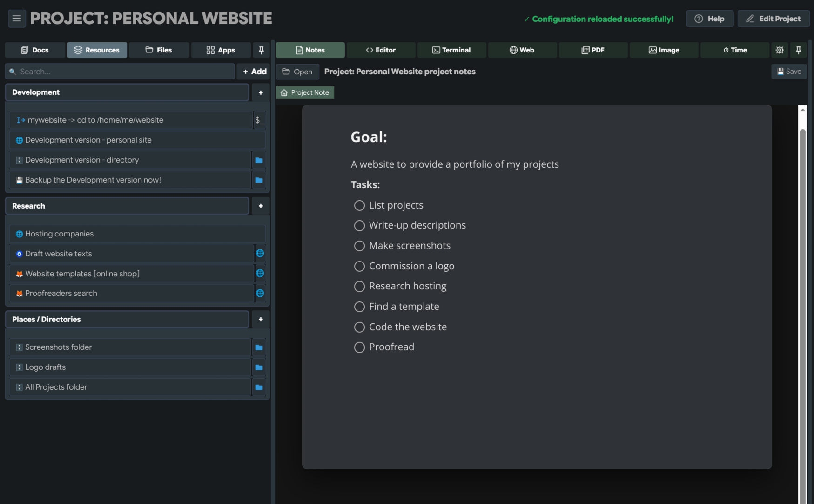
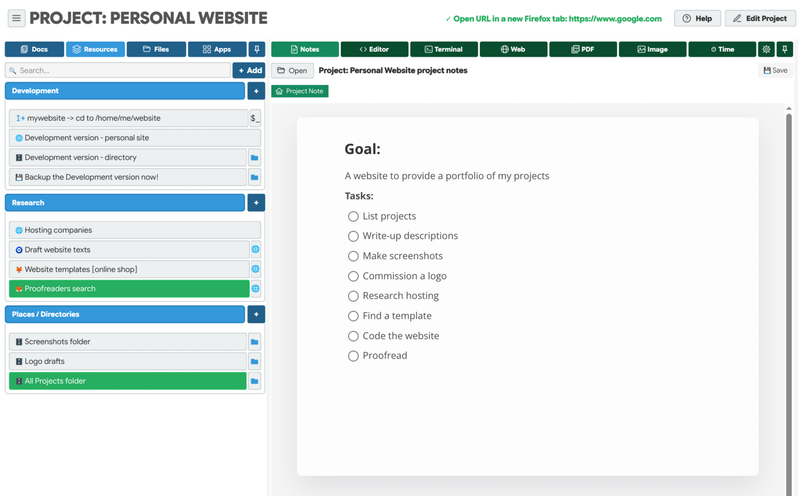

# About ProjectFlow

A graphical launcher for organizing your desktop around **projects**.





## Installation

### uv

```bash
uv venv
uv pip install PyQt6 PyQt6-WebEngine PyMuPDF qtconsole
uv run projectflow.py
```

### Standard Linux (Ubuntu, Fedora, Debian, etc.)

Install dependencies via pip:

```bash
pip install PyQt6 PyQt6-WebEngine PyMuPDF qtconsole
```

Or via your package manager (package names may vary):

```bash
# Debian/Ubuntu
sudo apt install python3-pyqt6 python3-pyqt6.qtwebengine python3-fitz
```

Then run:

```bash
./projectflow.py
```

Pass a project file as an argument to open a specific project directly: `./projectflow.py projects/myproject.json`

### NixOS

Use the provided wrapper script which handles dependencies automatically:

```bash
./projectflow-nix
```

## Goal

The overall goal of the ProjectFlow application is re-focusing desktop organization around **projects** — aggregating a project's files, documentation, websites, functions and routines in one place.

## Problem

Typically project resources reside in various directories, networks, websites, shortcuts, emails, applications, routines, notes. Switching between projects and tasks can create friction.

## Solution

ProjectFlow aims to aggregate project resources, while closely integrating and complementing existing desktop tools, applications and paradigms, making managing, revisiting and working on projects more productive and fun.

## Projects

Projects on a desktop could be many things. Some examples are:

- A software project - for example building a website
- A business task - such as filing quarterly tax returns
- A maintenance task like photo back-up
- An educational / learning activity
- A real-world hobby that combines online research, notes taking, helper applications

## Inspiration

The idea was inspired by articles and ongoing efforts towards **Semantic and Context-Oriented Desktops**. See the References section below.

## The idea

ProjectFlow treats a **project** as the basic unit of organization, and gives each project a single configuration file to house everything that belongs to it (**"items"**). The app provides quick-launch shortcuts to **items:** files, folders, websites, and terminal commands; Resources (PDF, image, web, code editor, terminal) can be edited, viewed, or launched in embedded viewer apps, or in the default desktop application. The application favours user curation of project items, with some automated helpers such as documentation discovery.

## ProjectFlow implementation

The application aims towards a project-oriented 'desktop' by enabling the desktop user to create project containers and assemble a wide variety of notes, links, websites, PDFs, images, Apps, directory locations related to the project - and to curate, edit and view these 'resources' within the ProjectFlow interface, or launch them in the default, or designated Application or Web/File browser.

## ProjectFlow layout

New projects default to a '2-column' layout; the 'blue' column on the left contains the 'Launcher' buttons that appear on the larger right-hand 'viewers'/editors, or in desktop applications.

- **Shortcuts** — the launcher column: categorized buttons for every file, folder, URL, or command that belongs to this project.
- **Viewer** — whatever you're currently looking at or working in: a web page, a PDF, an image, the code editor, a terminal, or your project notes (generally in Markdown file format).

## ProjectFlow formats

- **Notes** — project notes are in Markdown format and stored in a directory of choice. The notes can be edited in other [Markdown] editors
- **Project configs** — are in [JSON format](https://developer.mozilla.org/en-US/docs/Learn_web_development/Core/Scripting/JSON).
- **Portability** — the Notes, the project configs, can be backed-up or copied to share other computers (for example via NextCloud sync). Application settings are per-computer and also JSON
- **Resource storage** — files generally reside in their current locations on your computer - they are not imported. It may be useful to use for example Nextcloud Sync to store project files like images in a shared directory

## Alternatives

The application will not suit every type of desktop user/person. Some people achieve similar results using only their file-system, their browser, 'emacs', their code editor, wiki-type notes application, online project management, and so-forth. Some people have a single main 'project' - and do not often switch between projects. Nevertheless, the application is worth exploring and can also be used in tandem with other tools. See also the references below.

## Further information

- **Explore** — add a new project, add some items. Hover-over most buttons and menus for more information
- **[Launchers](help/tabs/02-launchers.html)** — how the Shortcuts column works: categories, launch handlers, aliases, drag-and-drop, and the Kickstart setup wizard.
- **[Viewers](help/tabs/03-viewers.html)** — the built-in Notes/Editor/Terminal/Web/PDF/Image/Time viewers, and how tabs work across them.
- **[Handlers](help/tabs/04-handlers.html)** — the mechanism for creating a button launcher.
- **[Integrations](help/tabs/05-integrations.html)** — Desktop integrations, Kimai time tracking, Joplin notes sync, and KDE Baloo file tags (so far).
- **[Settings](help/tabs/06-settings.html)** — the global Settings dialog and each project's own Settings viewer.
- **[Example](help/tabs/07-example.html)** — an example project.
- **[Tips](help/tabs/08-tips.html)** — additional functionality and ideas.

## References

- [Activities and the move to context-oriented desktops](https://lwn.net/Articles/334911/)
- [Conference Paper: Support for activity-based computing in a personal computing operating system](https://www.researchgate.net/publication/221519528_Support_for_activity-based_computing_in_a_personal_computing_operating_system)
- [Nepomuk (KDE User Base)](https://userbase.kde.org/Nepomuk)
- [Activity-Centric Computing Systems](https://cacm.acm.org/research/activity-centric-computing-systems/)
- [Nepomuk: Does anyone actually use it? (discussion)](https://www.reddit.com/r/kde/comments/pa80p/nepomuk_does_anyone_actually_use_it/)

## Alternative and Complementary Approaches

- [Wikipedia: Comparison of project management software](https://en.wikipedia.org/wiki/Comparison_of_project_management_software)
- [KDE Visual Design Group/Plasma Activities](https://community.kde.org/KDE_Visual_Design_Group/Plasma_Activities)
- [Emacs / Projects](https://taonaw.com/2024/12/24/how-i-handled-projects-in.html)
- [Obsidian / Project Management](https://taskforge.md/blog/obsidian-project-management/)
- [Visual Studio, Project Management, Solution Explorer](https://code.visualstudio.com/docs/csharp/project-management)
- [Baloo](https://community.kde.org/Baloo)

## License

MIT
